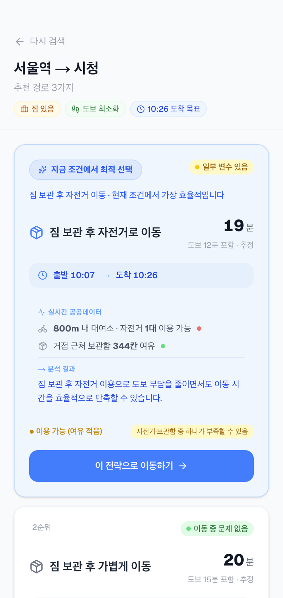
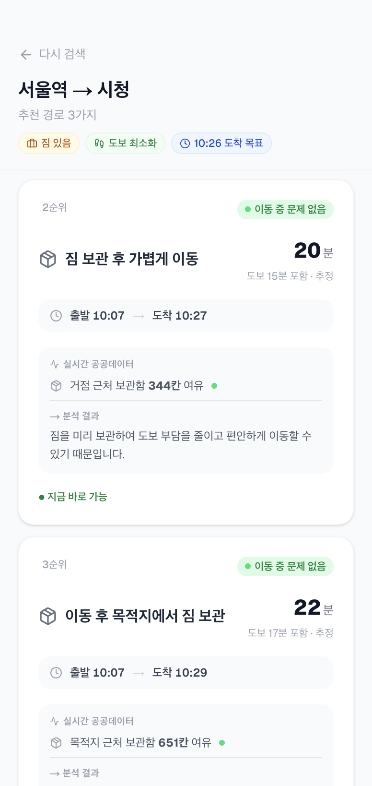
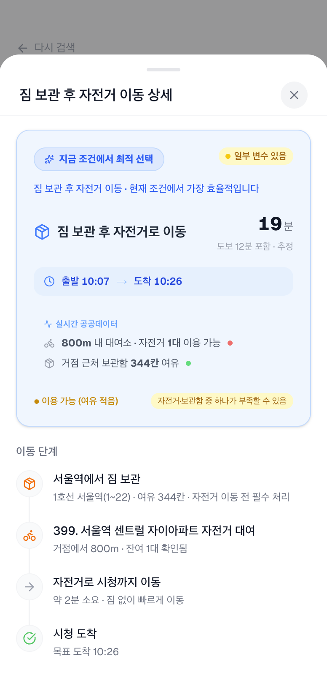
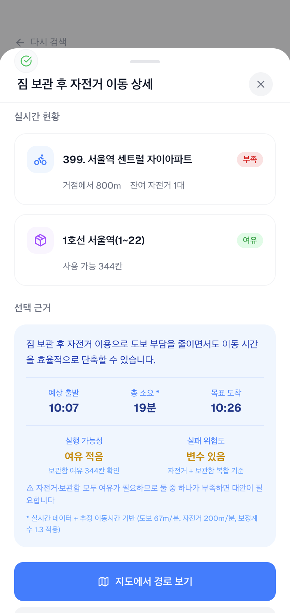

# MoveMate

도착 이후 이동 선택의 반복적인 고민을 해결하기 위해
공공데이터 기반으로 최적 이동 전략을 추천하는 서비스

## Demo

[](https://movemate-route.vercel.app)
[](https://drive.google.com/...)

## Preview

### Flow

<div align="center" style="display: flex; gap: 10px; justify-content: center;">

</div>

### Main

<div align="center" style="display: flex; gap: 10px; justify-content: center;">

</div>

### Input

<div align="center" style="display: flex; gap: 10px; justify-content: center;">


</div>

### Result

<div align="center" style="display: flex; flex-wrap: wrap; gap: 10px; justify-content: center;">
  
  
  
  
</div>

## Problem

기존 지도 서비스는 출발지 → 목적지 경로 안내에 집중되어 있어  
**도착 이후의 이동 방식 선택**은 사용자에게 맡겨져 있다.

특히 500~1500m 구간에서 도보·자전거·보관함 활용 등 다양한 선택지 사이에서  
사용자는 반복적으로 다음과 같은 고민을 겪는다.

- 짐이 있는데 자전거를 타도 될까?
- 도보 vs 자전거, 지금 어느 게 더 빠를까?
- 근처 공공자전거가 지금 남아 있을까?
- 정보를 확인하러 여러 앱을 오가는 피로

→ 단순 경로 안내가 아닌, **"지금 상황에서 어떤 선택이 최적인가"** 를 해결할 필요가 있다.

---

## Solution

공공데이터(자전거, 보관함)와 사용자 상황을 결합하여  
실행 가능한 이동 전략을 **점수 기반으로 추천**한다.

단순 추천에 그치지 않고 **실행 가능성과 실패 위험(failRisk)** 을 함께 제공하여  
실제 행동으로 이어지는 의사결정을 지원한다.

---

## Features

| 기능               | 설명                                                  |
| ------------------ | ----------------------------------------------------- |
| 이동 전략 추천     | WALK / BIKE / LOCKER 전략을 점수화하여 상위 옵션 제시 |
| 실시간 자원 필터링 | 반경 내 자전거·보관함 가용 여부 실시간 확인           |
| failRisk 분석      | 자원 부족·거리·복잡도 기반 실패 위험도 제공           |
| AI 판단 근거       | 추천 이유를 자연어로 설명 (Explainable AI)            |
| 경로 시각화        | 지도 기반 이동 경로 표시                              |

---

## System Flow

```
사용자 입력
  → 공공데이터 API 병렬 호출 (자전거 / 보관함)
  → 반경 기반 필터링
  → 전략 후보 생성 및 점수 계산
  → failRisk 분석
  → 상위 전략 추천
  → AI 판단 근거 생성
  → 결과 반환
```

---

## Tech Stack

| 분류       | 기술                 |
| ---------- | -------------------- |
| Frontend   | Next.js 15, React 19 |
| Language   | TypeScript           |
| State      | TanStack Query       |
| Validation | Zod                  |
| Map        | Leaflet              |
| AI         | OpenAI API           |
| Mobile     | Capacitor            |
| Deploy     | Vercel               |

---

## Tech Highlights

- **Haversine 공식** 기반 거리 계산 + 도로 보정계수(1.3) 적용 이동 시간 추정
- **공공데이터 API 병렬 처리** 구조로 응답 지연 최소화
- **전략 점수 알고리즘**: 거리·시간·자원 가용성을 종합 점수화
- **failRisk 모델링**: 자원 부족·거리·복잡도를 반영한 실패 위험도
- **추천(알고리즘)과 설명(AI) 분리 구조**: 판단과 표현을 독립적으로 설계

---

## Troubleshooting

**공공데이터 지역 코드 불일치**  
구 단위 조회 시 데이터가 존재하지 않는 경우 → 시 단위 조회 후 좌표 기반 필터링으로 해결

**API 불안정성**  
실시간 데이터 응답 실패 → fallback 전략 설계로 가용 전략만 선별 제공

**모바일 환경 대응**  
웹 서비스 모바일 확장 필요 → Capacitor 기반 앱 빌드로 대응

---

## Project Info

- 개발 기간: 2026.03 ~ 2026.04 (약 2주)
- 형태: 웹 + 모바일 앱 (Capacitor)
- 공공데이터 공모전 출품 프로젝트
- 📄 [개발 기획서](./docs/MoveMate_개발기획서.pdf)

### 활용 공공데이터

- 전국 공영자전거 실시간 정보
- 공영 물품보관함 실시간 정보
